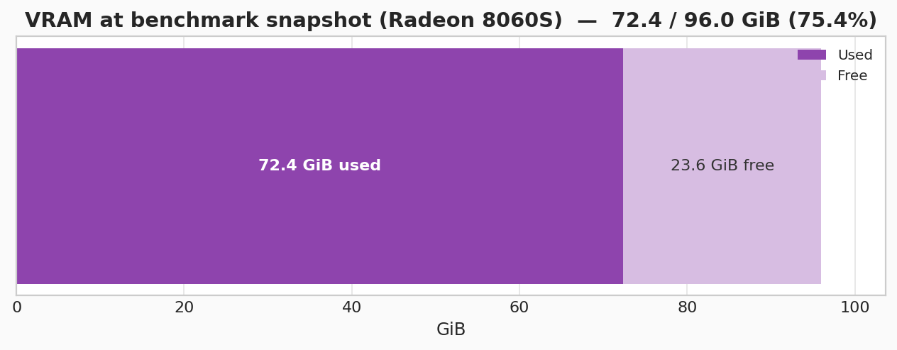
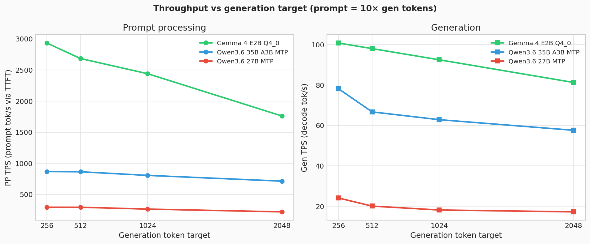
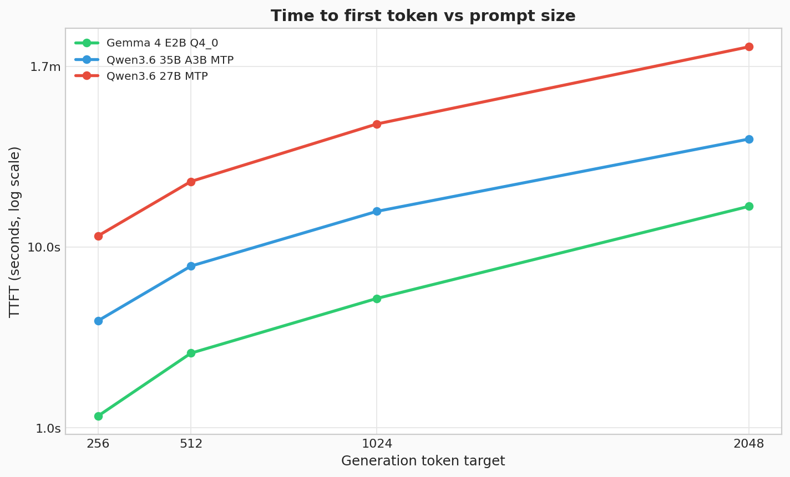
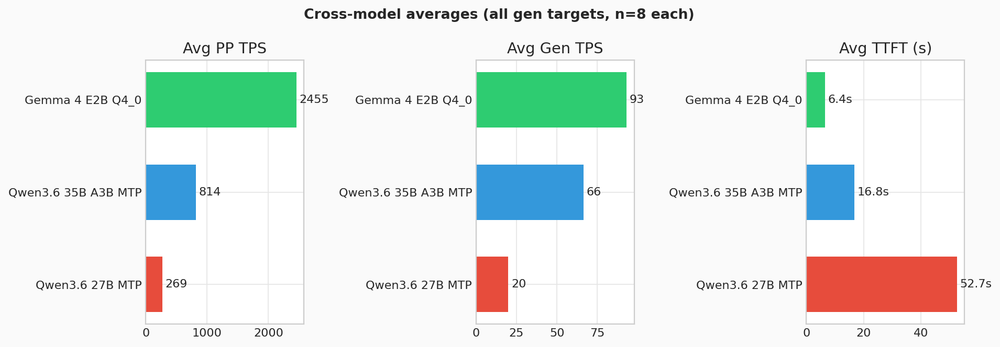

# PP/GEN Benchmark Results

Snapshot captured **2026-06-21T06:27 UTC** on host `nuc-nuc` while four `llama-server` (Vulkan) processes were running under Lemonade.

**Source data:** embedded below (`results.jsonl`)  
**Benchmark script:** embedded below (`pp_gen_bench.py`)  
**Charts:** embedded below as base64 PNGs

---

## Benchmark Command

```bash
cd /home/argakiig/full_learnings/benchmarks/localLLM
uv run --with OpenAI python pp_gen_bench.py --repeats 2 --jsonl ./results.jsonl
```

**Endpoint:** `http://10.0.0.30:13305/v1` (Lemonade OpenAI-compatible proxy)

**Defaults used by the script:**

| Setting | Value |
| --- | --- |
| Gen token targets | 256, 512, 1024, 2048 |
| Prompt ratio | 10× gen (2560 / 5120 / 10240 / 20480 word targets) |
| Models per round | `gemma-4-E2B-it-qat-q4_0-gguf-Q4_0`, `Qwen3.6-27B-MTP-GGUF`, `Qwen3.6-35B-A3B-MTP-GGUF` |
| Repeats | 2 (this run) |
| Warmup | 1 per model × token target |
| PP metric | TTFT (streaming wall-clock to first token) |
| PP TPS | `prompt_tokens / ttft_ms × 1000` |
| Gen TPS | server `predicted_ms` / `predicted_n` from final stream chunk |
| Prompt cache | off (`cache_prompt=false`) |

---

## Machine Stats

| Item | Value |
| --- | --- |
| Hostname | `nuc-nuc` |
| Kernel | Linux 7.1.1-znver5 (x86_64) |
| CPU | AMD Ryzen AI MAX+ 395 w/ Radeon 8060S |
| Cores / threads | 16C / 32T |
| Max CPU clock | 5187 MHz |
| L3 cache | 64 MiB |
| System RAM | 30 GiB total, **343 MiB available** at snapshot |
| Swap (zram) | 23 GiB total, **20 GiB used** |
| Root disk | 1.9 TiB NVMe, 33% used (575 GiB) |

**Memory pressure note:** RAM and swap were nearly exhausted at capture time. That can add variance to long-context runs.

---

## GPU Memory (VRAM)

**GPU:** Radeon 8060S Graphics (gfx1151, 40 CUs)  
**Tool:** `rocm-smi --showmeminfo vram`

| | Used | Total | Utilization |
| --- | ---: | ---: | ---: |
| **VRAM** | **72.36 GiB** | 96.00 GiB | 75.4% |

At snapshot: GPU edge temp 39 °C, package power 14 W, GPU busy 0% (idle between benchmark requests).



### Per-process VRAM

**Not available.** All four servers use the **Vulkan** build (`llamacpp/vulkan/llama-server`). `amd-smi process` reports *"No running processes detected"* because Vulkan allocations are not exposed as ROCm compute processes. Only system-wide VRAM totals are reported above.

Process RSS is also not meaningful here (weights live in GPU memory):

| PID | Port | RSS (ps) | VSZ |
| ---: | ---: | ---: | ---: |
| 88596 | 8004 | 8.5 MiB | 12.9 GiB |
| 88724 | 8003 | 75.4 MiB | 11.1 GiB |
| 88811 | 8001 | 8.5 MiB | 4.7 GiB |
| 89113 | 8005 | 8.2 MiB | 6.5 GiB |

---

## Running llama-server Processes

All launched by user `lemonade`, backend **Vulkan**, `-ngl 99`, `--ctx-size 65536`, `--parallel 1`.

### Benchmarked models (3)

#### 1. `gemma-4-E2B-it-qat-q4_0-gguf-Q4_0` — PID **89113**, port **8005**

Lemonade model size: 4.04 GB · max context 131072

```text
/var/lib/lemonade/.cache/lemonade/bin/llamacpp/vulkan/llama-server \
  -m .../gemma-4-E2B_q4_0-it.gguf \
  --ctx-size 65536 --port 8005 --jinja --metrics \
  --mmproj .../gemma-4-E2B-it-mmproj.gguf \
  --context-shift --keep 16 --reasoning-format auto \
  --no-webui --no-mmap -ngl 99 \
  --batch-size 2048 --cache-type-k f16 --cache-type-v f16 --flash-attn on \
  --min-p 0.0 --parallel 1 --temp 1.0 \
  --threads 16 --threads-batch 16 --top-k 64 --top-p 0.95 --ubatch-size 512
```

#### 2. `Qwen3.6-27B-MTP-GGUF` — PID **88596**, port **8004**

Lemonade model size: 17.5 GB · max context 262144 · draft-MTP enabled

```text
/var/lib/lemonade/.cache/lemonade/bin/llamacpp/vulkan/llama-server \
  -m .../Qwen3.6-27B-UD-Q4_K_XL.gguf \
  --ctx-size 65536 --port 8004 --jinja --metrics \
  --mmproj .../mmproj-F16.gguf \
  --keep 16 --reasoning-format auto --spec-draft-p-min 0.75 \
  --no-webui --no-mmap -ngl 99 --min-p 0.0 --no-context-shift --parallel 1 \
  --poll 100 --poll-batch 1 --repeat-penalty 1.0 \
  --spec-draft-n-max 3 --spec-draft-poll 1 --spec-draft-poll-batch 1 \
  --spec-draft-type-k f16 --spec-draft-type-v f16 --spec-type draft-mtp \
  --temp 0.7 --top-k 20 --top-p 0.95 \
  -b 2048 -ctk f16 -ctv f16 -fa on -sm row -t 16 -ub 512
```

#### 3. `Qwen3.6-35B-A3B-MTP-GGUF` — PID **88724**, port **8003**

Lemonade model size: 22.1 GB · max context 262144 · draft-MTP enabled

```text
/var/lib/lemonade/.cache/lemonade/bin/llamacpp/vulkan/llama-server \
  -m .../Qwen3.6-35B-A3B-UD-Q4_K_XL.gguf \
  --ctx-size 65536 --port 8003 --jinja --metrics \
  --mmproj .../mmproj-F16.gguf \
  --keep 16 --reasoning-format auto --spec-draft-p-min 0.75 \
  --no-webui --no-mmap -ngl 99 --min-p 0.0 --no-context-shift --parallel 1 \
  --poll 100 --poll-batch 1 --repeat-penalty 1.0 \
  --spec-draft-n-max 3 --spec-draft-poll 1 --spec-draft-poll-batch 1 \
  --spec-draft-type-k f16 --spec-draft-type-v f16 --spec-type draft-mtp \
  --temp 0.7 --top-k 20 --top-p 0.95 \
  -b 2048 -ctk f16 -ctv f16 -fa on -sm row -t 16 -ub 512
```

### Additional server (not in this benchmark matrix)

#### `Qwen3.6-35B-A3B-MTP-GGUF-MXFP4_MOE` — PID **88811**, port **8001**

Lemonade model size: 21.5 GB · max context 262144

```text
/var/lib/lemonade/.cache/lemonade/bin/llamacpp/vulkan/llama-server \
  -m .../Qwen3.6-35B-A3B-MXFP4_MOE.gguf \
  --ctx-size 65536 --port 8001 --jinja --metrics \
  --mmproj .../mmproj-BF16.gguf \
  --keep 16 --reasoning-format auto \
  --no-webui --no-mmap -ngl 99 --min-p 0.0 --no-context-shift --parallel 1 \
  --poll 100 --poll-batch 1 --repeat-penalty 1.0 \
  --spec-draft-n-max 3 --spec-draft-poll 1 --spec-draft-poll-batch 1 \
  --spec-draft-type-k f16 --spec-draft-type-v f16 --spec-type draft-mtp \
  --temp 0.7 --top-k 20 --top-p 0.95 \
  -b 2048 -ctk f16 -ctv f16 -fa on -sm row -t 16 -ub 512
```

---

## results.jsonl Overview

**28 lines total**

| Lines | Content |
| ---: | --- |
| 1–4 | Legacy single-model run (no `model` field); likely pre-multi-model script version |
| 5–28 | Multi-model matrix: 3 models × 4 gen targets × 2 repeats = 24 rows |

Each JSONL record fields: `model`, `case_name`, `target_gen_tokens`, `target_prompt_tokens`, `prompt_tokens`, `gen_tokens`, `ttft_ms`, `pp_tps`, `gen_ms`, `gen_tps`, `total_ms`, `overall_tps`, optional `draft_n` / `draft_n_accepted`.

---

## Multi-Model Results (mean of 2 repeats)

PP TPS = prompt tokens / TTFT. Gen TPS from server decode timings.

| Model | Case | Gen tgt | PP TPS | TTFT (ms) | Gen TPS | Draft accept |
| --- | --- | ---: | ---: | ---: | ---: | ---: |
| gemma-4-E2B-it-qat-q4_0-gguf-Q4_0 | support-triage | 256 | 2933 | 1164 | 100.8 | — |
| gemma-4-E2B-it-qat-q4_0-gguf-Q4_0 | code-review | 512 | 2685 | 2593 | 98.0 | — |
| gemma-4-E2B-it-qat-q4_0-gguf-Q4_0 | design-doc-summary | 1024 | 2441 | 5204 | 92.5 | — |
| gemma-4-E2B-it-qat-q4_0-gguf-Q4_0 | sql-analytics | 2048 | 1761 | 16804 | 81.3 | — |
| Qwen3.6-27B-MTP-GGUF | support-triage | 256 | 295 | 11531 | 24.1 | 94.5% |
| Qwen3.6-27B-MTP-GGUF | code-review | 512 | 294 | 23065 | 20.1 | 97.6% |
| Qwen3.6-27B-MTP-GGUF | design-doc-summary | 1024 | 265 | 47968 | 18.2 | 94.7% |
| Qwen3.6-27B-MTP-GGUF | sql-analytics | 2048 | 221 | 128097 | 17.3 | 92.9% |
| Qwen3.6-35B-A3B-MTP-GGUF | support-triage | 256 | 869 | 3914 | 78.2 | 94.6% |
| Qwen3.6-35B-A3B-MTP-GGUF | code-review | 512 | 865 | 7856 | 66.7 | 93.7% |
| Qwen3.6-35B-A3B-MTP-GGUF | design-doc-summary | 1024 | 807 | 15766 | 62.9 | 94.6% |
| Qwen3.6-35B-A3B-MTP-GGUF | sql-analytics | 2048 | 714 | 39583 | 57.6 | 93.2% |

### Cross-model averages (all gen targets)

| Model | Avg PP TPS | Avg TTFT (ms) | Avg Gen TPS | Runs |
| --- | ---: | ---: | ---: | ---: |
| gemma-4-E2B-it-qat-q4_0-gguf-Q4_0 | 2455 | 6441 | 93.1 | 8 |
| Qwen3.6-35B-A3B-MTP-GGUF | 814 | 16780 | 66.3 | 8 |
| Qwen3.6-27B-MTP-GGUF | 269 | 52665 | 19.9 | 8 |

---

## Visual Summary

Charts generated from multi-model rows in `results.jsonl` (lines 5–28, mean of 2 repeats per point). Images are embedded as base64 below. Regenerate with:

```bash
cd results
uv run --with matplotlib python generate_pp_gen_charts.py
python embed_pp_gen_results.py
```

### Throughput by generation target

PP TPS uses TTFT as the prompt-processing latency denominator. Prompt size scales at 10× the gen target.



### Time to first token

Log-scale view of how TTFT grows as prompt targets increase from 2560 to 20480 words.



### Cross-model comparison

Average PP TPS, gen TPS, and TTFT pooled across all four gen targets (8 runs per model).



---

## Observations

1. **Gemma 4 E2B (4B Q4_0)** is fastest on both PP and gen at every token target. No draft-MTP overhead; smallest model footprint (~4 GB declared).

2. **Qwen3.6-35B-A3B-MTP-GGUF (MoE, 22 GB)** sits in the middle: ~3× faster PP than dense 27B, ~3× faster gen. Draft acceptance ~93–95%.

3. **Qwen3.6-27B-MTP-GGUF (dense 17.5 GB)** is slowest here. PP TPS collapses on long prompts (TTFT 128 s at 2048 gen / ~28k prompt tokens). Dense 27B + four concurrent loaded models + memory pressure is a plausible contributor.

4. **PP TPS vs prompt length:** All models show declining PP TPS as prompt grows (fixed TTFT growth outpaces token count). Gemma retains the highest absolute PP TPS at 2048 gen target (1761 tok/s vs 714 / 221).

5. **Legacy rows (1–4):** Missing `model` field; metrics align with Qwen3.6-35B-A3B-class MTP behavior (draft stats present, PP TPS 760–891). Treat separately from the multi-model matrix.

6. **VRAM budget:** ~72 GiB VRAM in use with four models resident (75% of 96 GiB). Per-process split unavailable.

---

## Regenerating this document

```bash
cd results
uv run --with matplotlib python generate_pp_gen_charts.py
python embed_pp_gen_results.py
```

<!-- EMBEDDED-ASSETS:START -->

## Benchmark Source (`pp_gen_bench.py`)

```python
#!/usr/bin/env python3
"""PP/GEN benchmark for a Lemonade-backed llama.cpp OpenAI-compatible endpoint.

The benchmark uses realistic chat prompts sized at 10x the generation target,
measures time-to-first-token (TTFT) for prompt processing, and reports
generation TPS from server timings in the same streaming request.
"""

from __future__ import annotations

import argparse
import json
import random
import re
import sys
import time
from dataclasses import dataclass
from statistics import mean, median
from urllib.error import HTTPError, URLError
from urllib.request import Request, urlopen

MAX_TEMPERATURE = 0.1
SEED = 42
HTTP_TIMEOUT_S = 900
DEFAULT_BASE_URL = "http://10.0.0.30:13305/v1"
DEFAULT_MODELS = [
    "gemma-4-E2B-it-qat-q4_0-gguf-Q4_0",
    "Qwen3.6-27B-MTP-GGUF",
    "Qwen3.6-35B-A3B-MTP-GGUF",
]

SYSTEM_PROMPT = (
    "You are a practical engineering assistant. Be direct, accurate, and useful. "
    "When appropriate, use bullets and short sections."
)

# Realistic prompt families. These are intentionally varied so prompt processing
# sees a mix of chat, code, logs, planning, and analysis workloads.
PROMPT_CASES = [
    {
        "name": "support-triage",
        "lead": "Triage the issue below and propose the most likely root cause, then give a short fix plan.",
        "starter": (
            "We started seeing intermittent request failures after a rollout. "
            "The failures happen under load, not on a single request. "
            "Please reason from the evidence, not from guesswork."
        ),
        "blocks": [
            "Symptoms: users report timeouts when context windows are large, but smaller prompts still complete successfully.",
            "Logs: [info] slot released; [warn] prompt evaluation took longer than expected; [info] generation continued normally.",
            "Observed pattern: the first request after restart is slower than the rest, and the slowdown is more visible on long prompts.",
            "Environment: one host is CPU-only, another uses GPU offload, and both are serving through the same API shape.",
        ],
    },
    {
        "name": "code-review",
        "lead": "Review the code below and call out correctness issues, readability problems, and any benchmark bias you notice.",
        "starter": (
            "This script is used to compare prompt processing and generation throughput. "
            "I want feedback that would help turn it into a trustworthy benchmark."
        ),
        "blocks": [
            "```python\nfor i in range(repeats):\n    ttft = stream_first_token(prompt)\n    total = non_stream_total(prompt)\n    gen_time = total - ttft\n```",
            "The benchmark currently prints averages only, which can hide warmup effects and outliers.",
            "It uses repeated words as input and assumes word count is a close proxy for token count.",
            "A more representative benchmark should keep the request shape close to real chat traffic and avoid reusing the same prompt prefix if cache behavior is not what we want to measure.",
        ],
    },
    {
        "name": "design-doc-summary",
        "lead": "Summarize the design notes, extract the key tradeoffs, and list the open questions.",
        "starter": (
            "The document discusses serving a local model behind an OpenAI-compatible API. "
            "Please keep the summary grounded in the text and focus on performance implications."
        ),
        "blocks": [
            "We care about prompt ingestion, decode speed, queueing, and how batching changes observed latency under mixed workloads.",
            "The system should support both short interactive prompts and long context uploads without assuming either workload dominates.",
            "A benchmark that uses only one synthetic prompt shape can miss regressions that show up in real product usage.",
            "The output should include enough context for a human to decide whether a change is actually better or just different.",
        ],
    },
    {
        "name": "sql-analytics",
        "lead": "Help with the query and explain any performance concerns.",
        "starter": (
            "I need a SQL query for weekly active users and a short explanation of how the result should be interpreted. "
            "Assume the table is large and the query will run often."
        ),
        "blocks": [
            "Tables: events(user_id, event_time, event_name, plan_id), users(user_id, created_at, country).",
            "Desired output: week_start, active_users, new_users, and a retention-style ratio for the same period.",
            "Constraints: avoid scanning unnecessary columns and explain any date bucketing edge cases.",
            "The dashboard is used by product managers, so the answer should be concise but not vague.",
        ],
    },
    {
        "name": "incident-postmortem",
        "lead": "Analyze the incident timeline and propose a compact postmortem summary.",
        "starter": (
            "Below is a timeline of a production incident. Identify the sequence of failures, the user impact, and the likely prevention steps."
        ),
        "blocks": [
            "09:41 deploy starts; 09:44 latency climbs; 09:46 retries spike; 09:51 a subset of requests begin timing out.",
            "Impact: some requests complete, but long prompts are much more likely to trip the timeout budget.",
            "Mitigation: one team rolled back the deploy while another drained the queue and restarted the serving process.",
            "Follow-up items should distinguish between immediate mitigation, root cause, and monitoring gaps.",
        ],
    },
]

# Extra blocks keep prompts from becoming repetitive and make the workload feel
# more like a mixed production chat stream.
EXTRA_BLOCKS = [
    "Please include concrete numbers where available, even if they are approximate, and call out any assumptions explicitly.",
    "Here is a short code fragment: `cache_prompt = false` should be used when we want to measure real prompt ingestion, not KV reuse.",
    "The request often contains a system instruction, a user task, and some supporting context; keep that structure intact.",
    "We also care about tail behavior, so mention whether a single average hides a wide spread in latency.",
    "If you suggest a fix, separate it into immediate mitigation, longer-term change, and a verification step.",
    "The model is being served through a local endpoint, so transport overhead should be low compared with inference time.",
    "Include any caveats about comparing prompt processing TPS across very different prompt lengths.",
    "A realistic benchmark should include punctuation, numbers, lists, and at least some natural language variation.",
]


@dataclass
class CaseResult:
    model: str
    case_name: str
    target_prompt_tokens: int
    target_gen_tokens: int
    prompt_tokens: int
    gen_tokens: int
    ttft_ms: float
    gen_ms: float
    total_ms: float
    pp_tps: float
    gen_tps: float
    overall_tps: float
    draft_n: int | None = None
    draft_n_accepted: int | None = None


def normalize_base_url(url: str) -> str:
    url = url.rstrip("/")
    return url if url.endswith("/v1") else f"{url}/v1"


def word_count(text: str) -> int:
    return len(re.findall(r"\S+", text))


def build_messages(case: dict, target_prompt_tokens: int, run_seed: int, run_idx: int) -> list[dict[str, str]]:
    rng = random.Random(run_seed)
    blocks = list(case["blocks"])
    rng.shuffle(blocks)

    user_parts = [
        case["lead"],
        case["starter"],
        f"Run note: benchmark sample {run_idx + 1}; keep the answer grounded in the provided context.",
    ]

    # Pad with a varied mixture of realistic snippets until we cross the target.
    pool = blocks + EXTRA_BLOCKS
    i = 0
    while word_count("\n\n".join(user_parts)) < target_prompt_tokens:
        user_parts.append(pool[i % len(pool)])
        i += 1

    user_content = "\n\n".join(user_parts)
    return [
        {"role": "system", "content": SYSTEM_PROMPT},
        {"role": "user", "content": user_content},
    ]


def delta_has_visible_token(delta: dict) -> bool:
    """Return True when a streaming chunk carries the first visible model output."""
    content = delta.get("content")
    if isinstance(content, str) and content:
        return True
    reasoning = delta.get("reasoning_content")
    if isinstance(reasoning, str) and reasoning:
        return True
    tool_calls = delta.get("tool_calls")
    return bool(tool_calls)


def run_once(
    base_url: str,
    model: str,
    messages: list[dict[str, str]],
    gen_tokens: int,
    cache_prompt: bool,
    temperature: float,
    seed: int,
) -> dict:
    """Run one streaming chat completion and capture TTFT plus server timings."""
    payload = {
        "model": model,
        "messages": messages,
        "max_tokens": gen_tokens,
        "temperature": temperature,
        "seed": seed,
        "stream": True,
        "cache_prompt": cache_prompt,
        "timings_per_token": True,
        "include_usage": True,
    }
    data = json.dumps(payload).encode("utf-8")
    request = Request(
        f"{base_url}/chat/completions",
        data=data,
        headers={
            "Content-Type": "application/json",
            "Authorization": "Bearer no-key-needed",
        },
        method="POST",
    )

    start = time.perf_counter()
    ttft_ms: float | None = None
    timings: dict = {}
    usage: dict = {}

    try:
        with urlopen(request, timeout=HTTP_TIMEOUT_S) as response:
            for raw_line in response:
                line = raw_line.decode("utf-8").strip()
                if not line or line == "data: [DONE]":
                    continue
                if not line.startswith("data: "):
                    continue

                chunk = json.loads(line[6:])
                choices = chunk.get("choices") or []
                if choices:
                    delta = choices[0].get("delta") or {}
                    if ttft_ms is None and delta_has_visible_token(delta):
                        ttft_ms = (time.perf_counter() - start) * 1000.0

                if chunk.get("timings"):
                    timings = chunk["timings"]
                if chunk.get("usage"):
                    usage = chunk["usage"]
    except HTTPError as exc:
        body = exc.read().decode("utf-8", errors="replace")
        raise RuntimeError(f"HTTP {exc.code} from {base_url}/chat/completions: {body}") from exc
    except URLError as exc:
        raise RuntimeError(f"Failed to reach {base_url}/chat/completions: {exc}") from exc

    total_ms = (time.perf_counter() - start) * 1000.0
    return {
        "ttft_ms": ttft_ms or 0.0,
        "total_ms": total_ms,
        "timings": timings,
        "usage": usage,
    }


def summarize(nums: list[float]) -> str:
    if not nums:
        return "n/a"
    return f"mean={mean(nums):.1f} med={median(nums):.1f}"


def main() -> None:
    parser = argparse.ArgumentParser(description="PP/GEN benchmark for Lemonade + llama.cpp")
    parser.add_argument("--tokens", nargs="+", type=int, default=[256, 512, 1024, 2048], help="Generation token targets; prompt targets are pp-ratio x this value")
    parser.add_argument("--pp-ratio", type=int, default=10, help="Prompt token target multiplier relative to generation tokens")
    parser.add_argument("--repeats", type=int, default=3, help="Measured repeats per case")
    parser.add_argument("--warmup", type=int, default=1, help="Warmup runs per case (not included in stats)")
    parser.add_argument("--base-url", default=DEFAULT_BASE_URL, help="Lemonade / llama.cpp base URL")
    parser.add_argument(
        "--models",
        nargs="+",
        default=DEFAULT_MODELS,
        help="Models to benchmark each token round (default: all configured local models)",
    )
    parser.add_argument("--cache-prompt", action="store_true", help="Enable prompt caching (off by default for cold pp benchmarking)")
    parser.add_argument("--temperature", type=float, default=MAX_TEMPERATURE, help="Sampling temperature")
    parser.add_argument("--seed", type=int, default=SEED, help="Base seed for reproducibility")
    parser.add_argument("--jsonl", default="", help="Optional path to append JSONL results")
    args = parser.parse_args()

    base_url = normalize_base_url(args.base_url)
    cache_prompt = bool(args.cache_prompt)

    print(f"PP/GEN benchmark  url={base_url}")
    print(f"Models = {args.models}")
    print(f"Prompt cache = {'on' if cache_prompt else 'off'}  temperature = {args.temperature}  repeats = {args.repeats}  warmup = {args.warmup}")
    print(f"Gen token targets = {args.tokens}  prompt ratio = {args.pp_ratio}x")
    print()

    jsonl_handle = None
    if args.jsonl:
        jsonl_handle = open(args.jsonl, "a", encoding="utf-8")

    results: list[CaseResult] = []
    try:
        for p_idx, target_gen_tokens in enumerate(args.tokens):
            target_prompt_tokens = target_gen_tokens * args.pp_ratio
            case = PROMPT_CASES[p_idx % len(PROMPT_CASES)]

            for model in args.models:
                print(
                    f"--- model={model}  gen_target={target_gen_tokens}  "
                    f"prompt_target={target_prompt_tokens}  case={case['name']} ---"
                )

                message_seed = args.seed + p_idx * 1000 + target_gen_tokens * 10

                # Warmup runs are executed with the same shape but discarded.
                for warm_idx in range(args.warmup):
                    messages = build_messages(case, target_prompt_tokens, message_seed, warm_idx)
                    print(f"  warmup {warm_idx + 1}: {word_count(messages[1]['content'])} words in user prompt")
                    _ = run_once(
                        base_url,
                        model,
                        messages,
                        target_gen_tokens,
                        cache_prompt,
                        args.temperature,
                        args.seed,
                    )

                row: list[CaseResult] = []
                for run_idx in range(args.repeats):
                    messages = build_messages(case, target_prompt_tokens, message_seed, run_idx + args.warmup)
                    approx_words = word_count(messages[1]["content"])
                    print(
                        f"  run {run_idx + 1}/{args.repeats}  model={model}  gen_target={target_gen_tokens}  "
                        f"prompt_target={target_prompt_tokens}  user_words={approx_words}"
                    )
                    response = run_once(
                        base_url,
                        model,
                        messages,
                        target_gen_tokens,
                        cache_prompt,
                        args.temperature,
                        args.seed,
                    )
                    timings = response.get("timings", {})
                    usage = response.get("usage", {})

                    ttft_ms = float(response.get("ttft_ms", 0.0))
                    gen_ms = float(timings.get("predicted_ms", 0.0))
                    prompt_tokens = int(timings.get("prompt_n", usage.get("prompt_tokens", 0)) or 0)
                    gen_tokens = int(timings.get("predicted_n", usage.get("completion_tokens", 0)) or 0)
                    total_ms = float(response.get("total_ms", ttft_ms + gen_ms))
                    pp_tps = (prompt_tokens / ttft_ms * 1000.0) if ttft_ms > 0 else 0.0
                    gen_tps = (gen_tokens / gen_ms * 1000.0) if gen_ms > 0 else 0.0
                    overall_tps = ((prompt_tokens + gen_tokens) / total_ms * 1000.0) if total_ms > 0 else 0.0
                    draft_n = timings.get("draft_n")
                    draft_n_accepted = timings.get("draft_n_accepted")

                    result = CaseResult(
                        model=model,
                        case_name=case["name"],
                        target_prompt_tokens=target_prompt_tokens,
                        target_gen_tokens=target_gen_tokens,
                        prompt_tokens=prompt_tokens,
                        gen_tokens=gen_tokens,
                        ttft_ms=ttft_ms,
                        gen_ms=gen_ms,
                        total_ms=total_ms,
                        pp_tps=pp_tps,
                        gen_tps=gen_tps,
                        overall_tps=overall_tps,
                        draft_n=int(draft_n) if draft_n is not None else None,
                        draft_n_accepted=int(draft_n_accepted) if draft_n_accepted is not None else None,
                    )
                    row.append(result)
                    results.append(result)

                    print(
                        f"    prompt={prompt_tokens} tok ({pp_tps:.1f} tok/s, ttft={ttft_ms:.0f} ms)  "
                        f"gen={gen_tokens} tok ({gen_tps:.1f} tok/s, {gen_ms:.0f} ms)  total={total_ms:.0f} ms"
                    )
                    if result.draft_n is not None and result.draft_n > 0:
                        acc = result.draft_n_accepted or 0
                        print(f"    draft={result.draft_n} accepted={acc} accept_rate={(acc / result.draft_n):.2%}")

                    if jsonl_handle:
                        jsonl_handle.write(
                            json.dumps(
                                {
                                    "model": result.model,
                                    "case_name": result.case_name,
                                    "target_gen_tokens": result.target_gen_tokens,
                                    "target_prompt_tokens": result.target_prompt_tokens,
                                    "prompt_tokens": result.prompt_tokens,
                                    "gen_tokens": result.gen_tokens,
                                    "ttft_ms": result.ttft_ms,
                                    "gen_ms": result.gen_ms,
                                    "total_ms": result.total_ms,
                                    "pp_tps": result.pp_tps,
                                    "gen_tps": result.gen_tps,
                                    "overall_tps": result.overall_tps,
                                    "draft_n": result.draft_n,
                                    "draft_n_accepted": result.draft_n_accepted,
                                },
                                sort_keys=True,
                            )
                            + "\n"
                        )
                        jsonl_handle.flush()

                ttft_ms_values = [r.ttft_ms for r in row]
                pp_tps_values = [r.pp_tps for r in row]
                gen_tps_values = [r.gen_tps for r in row]
                gen_ms_values = [r.gen_ms for r in row]
                total_ms_values = [r.total_ms for r in row]
                print(
                    f"  AVG ({model}): pp_tps {summarize(pp_tps_values)} | ttft_ms {summarize(ttft_ms_values)} | "
                    f"gen_tps {summarize(gen_tps_values)} | gen_ms {summarize(gen_ms_values)} | "
                    f"total_ms {summarize(total_ms_values)}"
                )
                print()

        print("=" * 146)
        print("SUMMARY")
        print("=" * 146)
        print(
            f"{'model':<36} {'case':<18} {'g_tgt':>6} {'p_tgt':>7} {'p_tok':>8} {'g_tok':>8} "
            f"{'pp_tps':>10} {'ttft_ms':>10} {'g_tps':>10} {'g_ms':>10} {'tot_ms':>10}"
        )
        print("-" * 146)
        for r in results:
            print(
                f"{r.model:<36} {r.case_name:<18} {r.target_gen_tokens:>6} {r.target_prompt_tokens:>7} "
                f"{r.prompt_tokens:>8} {r.gen_tokens:>8} {r.pp_tps:>10.1f} {r.ttft_ms:>10.1f} "
                f"{r.gen_tps:>10.1f} {r.gen_ms:>10.1f} {r.total_ms:>10.1f}"
            )
    finally:
        if jsonl_handle:
            jsonl_handle.close()


if __name__ == "__main__":
    main()

```

## Raw `results.jsonl`

```jsonl
{"case_name": "support-triage", "draft_n": 305, "draft_n_accepted": 193, "gen_ms": 3643.979, "gen_tokens": 256, "gen_tps": 70.25287467353682, "overall_tps": 490.1881090888756, "pp_tps": 891.3657236793265, "prompt_tokens": 3400, "target_gen_tokens": 256, "target_prompt_tokens": 2560, "total_ms": 7458.36125400001, "ttft_ms": 3814.3714859998}
{"case_name": "code-review", "draft_n": 679, "draft_n_accepted": 375, "gen_ms": 8181.511, "gen_tokens": 512, "gen_tps": 62.58012731389104, "overall_tps": 458.32889853531316, "pp_tps": 875.920919567449, "prompt_tokens": 6792, "target_gen_tokens": 512, "target_prompt_tokens": 5120, "total_ms": 15936.154197000178, "ttft_ms": 7754.12465699992}
{"case_name": "design-doc-summary", "draft_n": 1470, "draft_n_accepted": 728, "gen_ms": 18221.978, "gen_tokens": 1024, "gen_tps": 56.19587511300914, "overall_tps": 416.9899783315444, "pp_tps": 864.3391797527803, "prompt_tokens": 12703, "target_gen_tokens": 1024, "target_prompt_tokens": 10240, "total_ms": 32919.25636900032, "ttft_ms": 14696.776795000005}
{"case_name": "sql-analytics", "draft_n": 2787, "draft_n_accepted": 1488, "gen_ms": 37381.859, "gen_tokens": 2048, "gen_tps": 54.78593239571098, "overall_tps": 406.0700635966163, "pp_tps": 759.3311279022793, "prompt_tokens": 28252, "target_gen_tokens": 2048, "target_prompt_tokens": 20480, "total_ms": 74617.66506900039, "ttft_ms": 37206.42939800018}
{"case_name": "support-triage", "draft_n": null, "draft_n_accepted": null, "gen_ms": 2545.044, "gen_tokens": 256, "gen_tps": 100.58765192271726, "model": "gemma-4-E2B-it-qat-q4_0-gguf-Q4_0", "overall_tps": 999.4860135684512, "pp_tps": 2952.016411614068, "prompt_tokens": 3413, "target_gen_tokens": 256, "target_prompt_tokens": 2560, "total_ms": 3670.8867859997554, "ttft_ms": 1156.1588839995238}
{"case_name": "support-triage", "draft_n": null, "draft_n_accepted": null, "gen_ms": 2536.13, "gen_tokens": 256, "gen_tps": 100.94119780926056, "model": "gemma-4-E2B-it-qat-q4_0-gguf-Q4_0", "overall_tps": 997.7894373425092, "pp_tps": 2914.5014509743582, "prompt_tokens": 3413, "target_gen_tokens": 256, "target_prompt_tokens": 2560, "total_ms": 3677.1285229997375, "ttft_ms": 1171.0407620003025}
{"case_name": "support-triage", "draft_n": 183, "draft_n_accepted": 173, "gen_ms": 10521.668, "gen_tokens": 256, "gen_tps": 24.330742996262572, "model": "Qwen3.6-27B-MTP-GGUF", "overall_tps": 165.7505839758639, "pp_tps": 294.86979611378575, "prompt_tokens": 3400, "target_gen_tokens": 256, "target_prompt_tokens": 2560, "total_ms": 22057.23752099948, "ttft_ms": 11530.51294099987}
{"case_name": "support-triage", "draft_n": 181, "draft_n_accepted": 171, "gen_ms": 10709.457, "gen_tokens": 256, "gen_tps": 23.90410643602192, "model": "Qwen3.6-27B-MTP-GGUF", "overall_tps": 164.3803296174142, "pp_tps": 294.84435394234606, "prompt_tokens": 3400, "target_gen_tokens": 256, "target_prompt_tokens": 2560, "total_ms": 22241.103960000146, "ttft_ms": 11531.507911000517}
{"case_name": "support-triage", "draft_n": 188, "draft_n_accepted": 170, "gen_ms": 3310.613, "gen_tokens": 256, "gen_tps": 77.32706903525117, "model": "Qwen3.6-35B-A3B-MTP-GGUF", "overall_tps": 505.96898972832514, "pp_tps": 868.8075831820671, "prompt_tokens": 3400, "target_gen_tokens": 256, "target_prompt_tokens": 2560, "total_ms": 7225.739272999817, "ttft_ms": 3913.409672999478}
{"case_name": "support-triage", "draft_n": 173, "draft_n_accepted": 171, "gen_ms": 3240.936, "gen_tokens": 256, "gen_tps": 78.98952648247295, "model": "Qwen3.6-35B-A3B-MTP-GGUF", "overall_tps": 511.0250968341539, "pp_tps": 868.7474782769586, "prompt_tokens": 3400, "target_gen_tokens": 256, "target_prompt_tokens": 2560, "total_ms": 7154.2474580001, "ttft_ms": 3913.6804249992565}
{"case_name": "code-review", "draft_n": null, "draft_n_accepted": null, "gen_ms": 5216.753, "gen_tokens": 512, "gen_tps": 98.14534059787765, "model": "gemma-4-E2B-it-qat-q4_0-gguf-Q4_0", "overall_tps": 961.2085182490533, "pp_tps": 2685.442418865691, "prompt_tokens": 6960, "target_gen_tokens": 512, "target_prompt_tokens": 5120, "total_ms": 7773.5474229994, "ttft_ms": 2591.751717000079}
{"case_name": "code-review", "draft_n": null, "draft_n_accepted": null, "gen_ms": 5230.147, "gen_tokens": 512, "gen_tps": 97.89399800808658, "model": "gemma-4-E2B-it-qat-q4_0-gguf-Q4_0", "overall_tps": 959.3627204484968, "pp_tps": 2683.811442336162, "prompt_tokens": 6960, "target_gen_tokens": 512, "target_prompt_tokens": 5120, "total_ms": 7788.5035979998065, "ttft_ms": 2593.326748000436}
{"case_name": "code-review", "draft_n": 318, "draft_n_accepted": 308, "gen_ms": 25559.99, "gen_tokens": 512, "gen_tps": 20.031306741512807, "model": "Qwen3.6-27B-MTP-GGUF", "overall_tps": 150.18727939718093, "pp_tps": 294.3776703293114, "prompt_tokens": 6792, "target_gen_tokens": 512, "target_prompt_tokens": 5120, "total_ms": 48632.614089000526, "ttft_ms": 23072.40217100025}
{"case_name": "code-review", "draft_n": 314, "draft_n_accepted": 309, "gen_ms": 25373.006, "gen_tokens": 512, "gen_tps": 20.17892558729541, "model": "Qwen3.6-27B-MTP-GGUF", "overall_tps": 150.81193232213096, "pp_tps": 294.563763999311, "prompt_tokens": 6792, "target_gen_tokens": 512, "target_prompt_tokens": 5120, "total_ms": 48431.18105800022, "ttft_ms": 23057.825944999422}
{"case_name": "code-review", "draft_n": 319, "draft_n_accepted": 298, "gen_ms": 7687.072, "gen_tokens": 512, "gen_tps": 66.60533425470712, "model": "Qwen3.6-35B-A3B-MTP-GGUF", "overall_tps": 469.83768286961043, "pp_tps": 864.2418458956885, "prompt_tokens": 6792, "target_gen_tokens": 512, "target_prompt_tokens": 5120, "total_ms": 15545.794358999956, "ttft_ms": 7858.911289999924}
{"case_name": "code-review", "draft_n": 317, "draft_n_accepted": 298, "gen_ms": 7662.157, "gen_tokens": 512, "gen_tps": 66.82191450788596, "model": "Qwen3.6-35B-A3B-MTP-GGUF", "overall_tps": 470.66233454533864, "pp_tps": 864.9192860831279, "prompt_tokens": 6792, "target_gen_tokens": 512, "target_prompt_tokens": 5120, "total_ms": 15518.556433999947, "ttft_ms": 7852.755868999338}
{"case_name": "design-doc-summary", "draft_n": null, "draft_n_accepted": null, "gen_ms": 11062.6, "gen_tokens": 1024, "gen_tps": 92.5641350134688, "model": "gemma-4-E2B-it-qat-q4_0-gguf-Q4_0", "overall_tps": 845.871023776144, "pp_tps": 2442.793356933297, "prompt_tokens": 12701, "target_gen_tokens": 1024, "target_prompt_tokens": 10240, "total_ms": 16225.877957999728, "ttft_ms": 5199.375528000019}
{"case_name": "design-doc-summary", "draft_n": null, "draft_n_accepted": null, "gen_ms": 11081.025, "gen_tokens": 1024, "gen_tps": 92.41022378344964, "model": "gemma-4-E2B-it-qat-q4_0-gguf-Q4_0", "overall_tps": 844.498707011006, "pp_tps": 2438.5504392973626, "prompt_tokens": 12701, "target_gen_tokens": 1024, "target_prompt_tokens": 10240, "total_ms": 16252.245132000098, "ttft_ms": 5208.422099999552}
{"case_name": "design-doc-summary", "draft_n": 624, "draft_n_accepted": 590, "gen_ms": 55738.38, "gen_tokens": 1024, "gen_tps": 18.371542194086015, "model": "Qwen3.6-27B-MTP-GGUF", "overall_tps": 131.6507907184209, "pp_tps": 261.8352242894523, "prompt_tokens": 12703, "target_gen_tokens": 1024, "target_prompt_tokens": 10240, "total_ms": 104268.26853900001, "ttft_ms": 48515.24478600004}
{"case_name": "design-doc-summary", "draft_n": 612, "draft_n_accepted": 580, "gen_ms": 56971.431, "gen_tokens": 1024, "gen_tps": 17.973920999105673, "model": "Qwen3.6-27B-MTP-GGUF", "overall_tps": 131.47920109719908, "pp_tps": 267.88324776083226, "prompt_tokens": 12703, "target_gen_tokens": 1024, "target_prompt_tokens": 10240, "total_ms": 104404.3459759996, "ttft_ms": 47419.91186899941}
{"case_name": "design-doc-summary", "draft_n": 612, "draft_n_accepted": 573, "gen_ms": 16476.602, "gen_tokens": 1024, "gen_tps": 62.14873673588766, "model": "Qwen3.6-35B-A3B-MTP-GGUF", "overall_tps": 419.7891849838743, "pp_tps": 782.2299065447481, "prompt_tokens": 12703, "target_gen_tokens": 1024, "target_prompt_tokens": 10240, "total_ms": 32699.746660999153, "ttft_ms": 16239.47114999919}
{"case_name": "design-doc-summary", "draft_n": 609, "draft_n_accepted": 582, "gen_ms": 16107.961, "gen_tokens": 1024, "gen_tps": 63.57105036447506, "model": "Qwen3.6-35B-A3B-MTP-GGUF", "overall_tps": 436.942263045778, "pp_tps": 830.7022943851118, "prompt_tokens": 12703, "target_gen_tokens": 1024, "target_prompt_tokens": 10240, "total_ms": 31416.050038999856, "ttft_ms": 15291.88023900042}
{"case_name": "sql-analytics", "draft_n": null, "draft_n_accepted": null, "gen_ms": 25066.455, "gen_tokens": 2048, "gen_tps": 81.70281757033453, "model": "gemma-4-E2B-it-qat-q4_0-gguf-Q4_0", "overall_tps": 766.0421236680669, "pp_tps": 1820.6874582832766, "prompt_tokens": 29561, "target_gen_tokens": 2048, "target_prompt_tokens": 20480, "total_ms": 41262.74394500069, "ttft_ms": 16236.174894000214}
{"case_name": "sql-analytics", "draft_n": null, "draft_n_accepted": null, "gen_ms": 25335.829, "gen_tokens": 2048, "gen_tps": 80.83414203656015, "model": "gemma-4-E2B-it-qat-q4_0-gguf-Q4_0", "overall_tps": 739.9361904460998, "pp_tps": 1701.5685058371755, "prompt_tokens": 29561, "target_gen_tokens": 2048, "target_prompt_tokens": 20480, "total_ms": 42718.54844799964, "ttft_ms": 17372.794511999928}
{"case_name": "sql-analytics", "draft_n": 1291, "draft_n_accepted": 1199, "gen_ms": 115820.261, "gen_tokens": 2048, "gen_tps": 17.68257110040531, "model": "Qwen3.6-27B-MTP-GGUF", "overall_tps": 124.90441537811068, "pp_tps": 222.86612625446173, "prompt_tokens": 28252, "target_gen_tokens": 2048, "target_prompt_tokens": 20480, "total_ms": 242585.49954599948, "ttft_ms": 126766.68489199983}
{"case_name": "sql-analytics", "draft_n": 1233, "draft_n_accepted": 1146, "gen_ms": 121610.958, "gen_tokens": 2048, "gen_tps": 16.84058767138402, "model": "Qwen3.6-27B-MTP-GGUF", "overall_tps": 120.70545500979237, "pp_tps": 218.2857745037666, "prompt_tokens": 28252, "target_gen_tokens": 2048, "target_prompt_tokens": 20480, "total_ms": 251024.280530999, "ttft_ms": 129426.6658659999}
{"case_name": "sql-analytics", "draft_n": 1241, "draft_n_accepted": 1171, "gen_ms": 34677.915, "gen_tokens": 2048, "gen_tps": 59.057760537217995, "model": "Qwen3.6-35B-A3B-MTP-GGUF", "overall_tps": 402.20915423254814, "pp_tps": 695.0322795136362, "prompt_tokens": 28252, "target_gen_tokens": 2048, "target_prompt_tokens": 20480, "total_ms": 75333.9392730013, "ttft_ms": 40648.47178000127}
{"case_name": "sql-analytics", "draft_n": 1201, "draft_n_accepted": 1106, "gen_ms": 36451.813, "gen_tokens": 2048, "gen_tps": 56.183762382408794, "model": "Qwen3.6-35B-A3B-MTP-GGUF", "overall_tps": 404.1627251549961, "pp_tps": 733.4660810449448, "prompt_tokens": 28252, "target_gen_tokens": 2048, "target_prompt_tokens": 20480, "total_ms": 74969.80328500103, "ttft_ms": 38518.48194500053}
```

<!-- EMBEDDED-ASSETS:END -->


